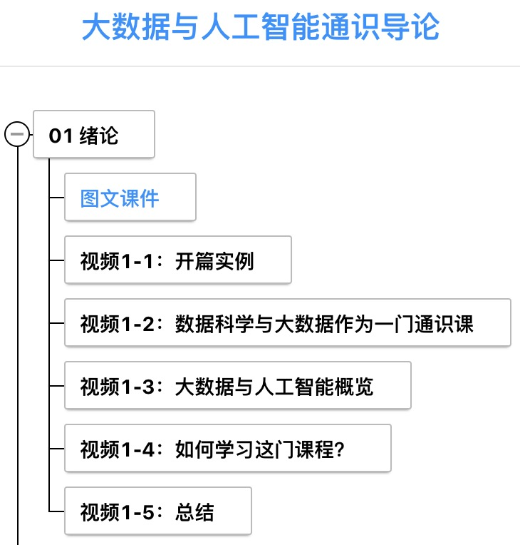
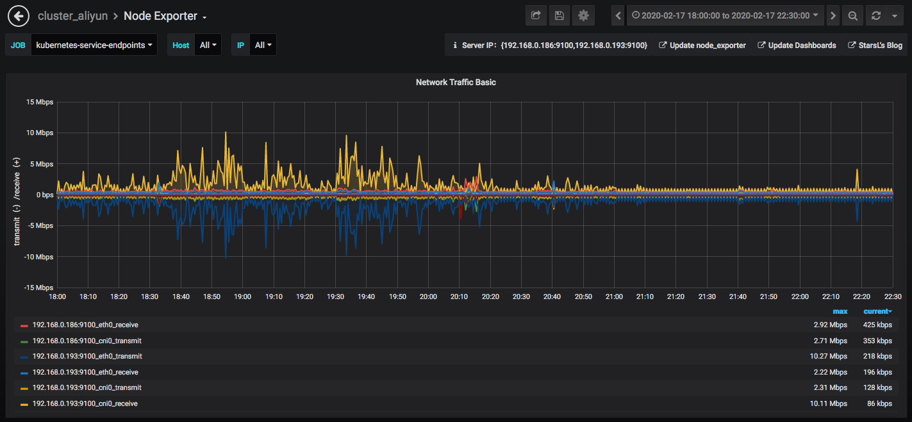
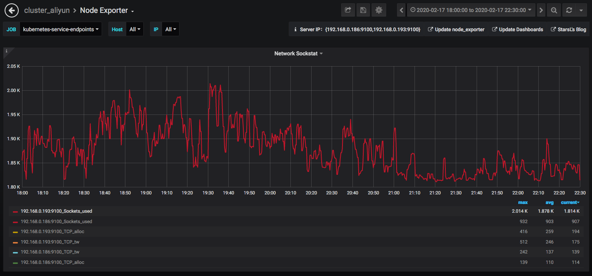
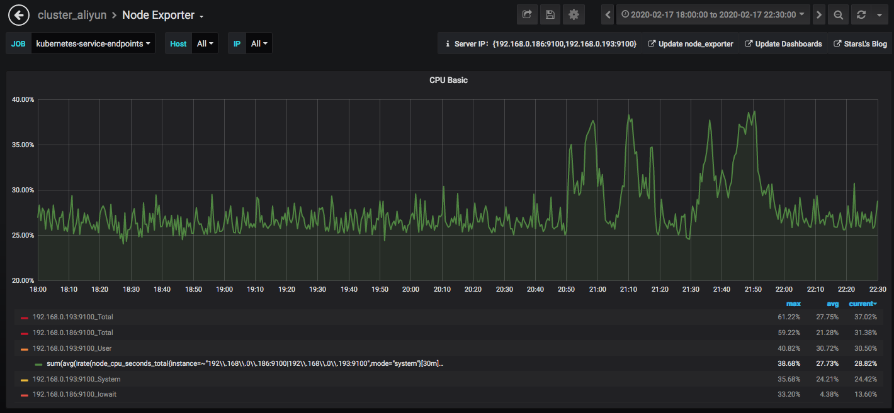

《大数据与人工智能通识导论》周报 Week1
=
**开设学校**：湖北大学

**任课教师**：杨丽

**课程时间**：周一 19:00-21:35

**上课人数**：104人

**设课形式**：理论课采用MOOC的形式，主要以视频播放为主，配合微信群进行答疑。

一、本次课程内容
-

大数据与人工智能通识导论课程绪论，概览大数据与人工智能以及如何学习这门课程介绍。

二、课程形式
-

学生通过KFCoding平台的课程入口进入，进行视频学习。

三、数据情况
-

这次课程为本学期第一次授课，上课学生部分信息如下图：

周一晚上上课时，服务器运行稳定，大体情况如下：
- **学生:**
  1. 部分学生习惯在上课前对课程内容进行访问，高峰出现在规定开始上课的时间端。
  2. 由于课程提前录制完毕，大约一节课的时间后，学生发起请求的数量明显减少，可能存在视频没看全的情况。
  3. 这次的学生上课数据可与以后的数据联动进行观察，以判断学生的上课效率。

- **服务器:**
  1. 在19：00时，系统负载达到最高，但未超过70%，能达到课程所需要的服务级别。
  2. 系统cpu占用率并不高，用户cpu占用也没有遇到瓶颈。
  3. 后续继续采集课程数据，以供对课程的分析需求。

