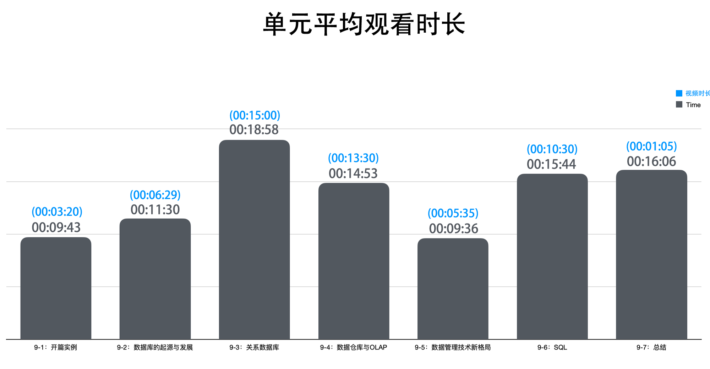
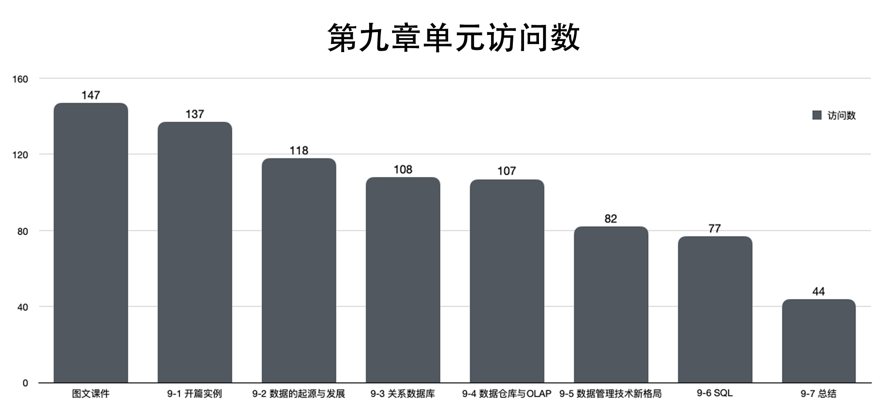
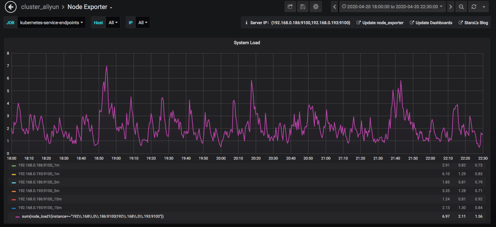
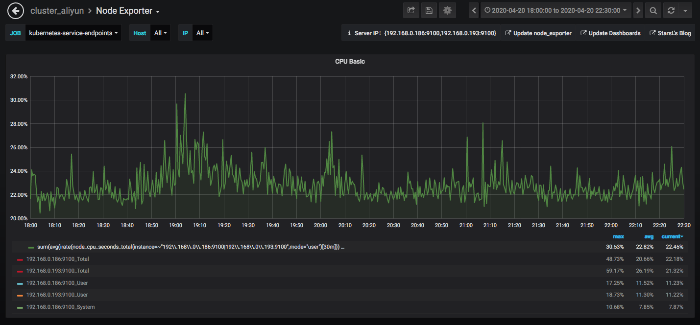
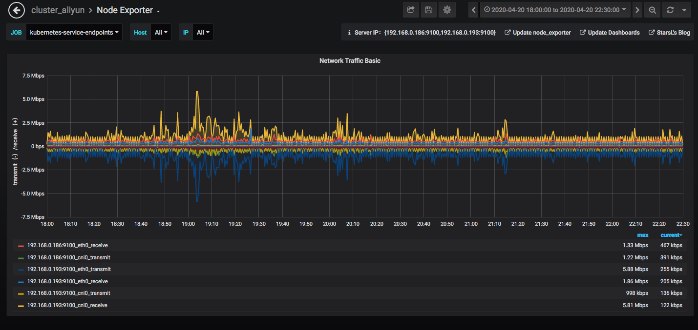
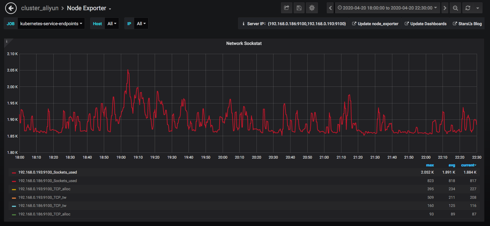

《大数据与人工智能通识导论》周报 Week10
=
**开设学校**：湖北大学

**任课教师**：杨丽

**课程时间**：周一 19:00-21:35

**上课人数**：104人

**设课形式**：理论课采用MOOC的形式，主要以视频播放为主，配合微信群进行答疑。

一、本次课程内容
-

- 基础设施 
  - 图文课件
  - 开篇实例
  - 数据库的起源与发展
  - 关系数据库
  - 数据仓库与OLAP
  - 数据管理技术新格局
  - SQL
  - 总结

二、课程形式
-

学生通过KFCoding平台的课程入口进入，结合PPT进行视频学习。

三、数据情况
-

- **学生:**
  1. 受数据库变动影响，总访问人数基本不会变动，章节参与人数出现下滑，考虑为历史数据的丢失导致，也反映在指定时间段内并非所有学员参与了课程学习。
  2. 与上次课程相比，本章节的访问人数出现下降趋势，有学员没有及时参与课程。
  3. 相交于上一周。本章视频总访问人数减少了，也与本章节访问人数持平，说明未及时参与课程内容的学生连课程单元都未进入。
  4. 本周课程视频的单元平均观看时间相较于原视频时间普遍出现观看时间长于视频时间的现象，尤其是总结单元，观看时间与预期完全不符，考虑与时间数据的收集方式有直接关系，可以考虑改变收集策略。
  5. 此平均时间数据未算上没有访问课程的用户，因此，参与视频课程的用户基本能完整看完视频。由于统计方式的特殊性，时间统计存在不可忽视的误差，但也具有指导意义。

- **服务器:**
  1. 大部分客户端请求仍集中在19：00以后，并且呈稳定访问趋势。且峰值波动不明显。（与人数减少相关）
  2. 周一的运行情况看来服务器并没有出现高负载情况，系统cpu占用率并不高，用户cpu占用也没有遇到瓶颈，完全能满足上课所需。
  3. 每个账号具体的单元停留时间数据保存于[ Week10.csv](./scripts/Week10.csv)文件中，可自行查看。

