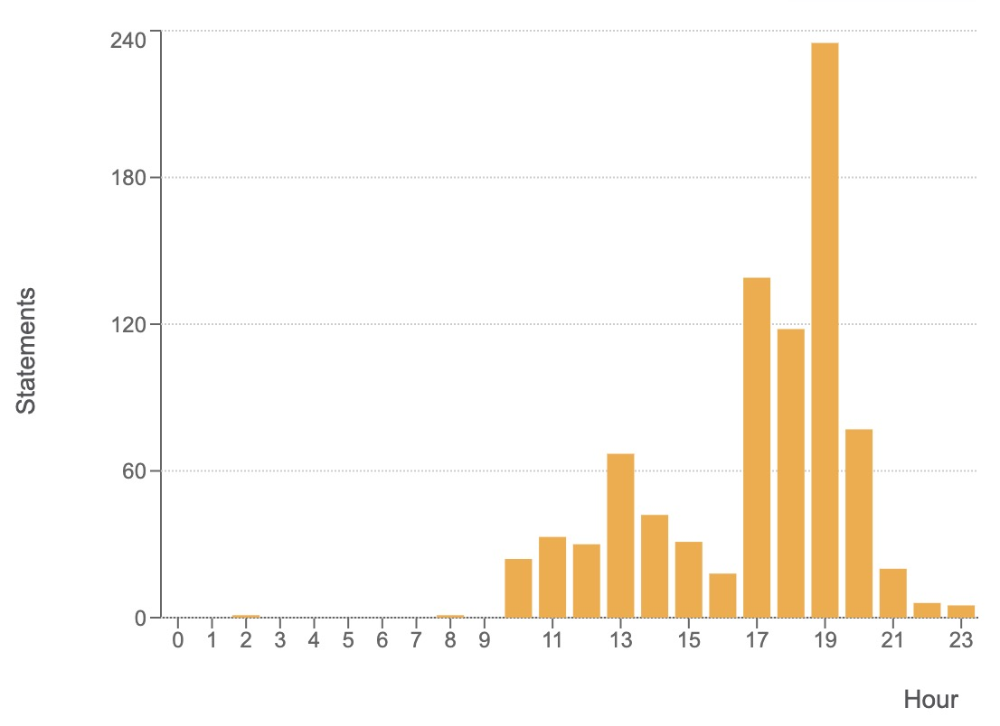

《大数据与人工智能通识导论》周报 Week2
=
**开设学校**：湖北大学

**任课教师**：杨丽

**课程时间**：周一 19:00-21:35

**上课人数**：104人

**设课形式**：理论课采用MOOC的形式，主要以视频播放为主，配合微信群进行答疑。

一、本次课程内容
-

- 信息文明
  - 图文课件
  - 开篇实例
  - 人类文明的发展
  - 信息革命
  - 从IT时代到DT时代
  - 总结

二、课程形式
-

学生通过KFCoding平台的课程入口进入，结合PPT进行视频学习。

三、数据情况
-

- **学生:**
  1. 学生依旧存在提前看课程行为，高峰出现在规定开始上课的时间端。
  2. 与上一次课程相比，学生总体点击率存在下降趋势（约30%），考虑因素为：对平台熟练度的提升或存在偷懒行为。
  3. 从后台数据观察，学生请求减少发生时间相较上次课有前移趋势，观察后台数据可发现，部分学生当天下午就会提前查看本次课程内容进而减少了上课期间的访问数量。

- **服务器:**
  1. 同样的，在19：00左右，系统负载达到最高，但与上次课相比，峰值降低，完全能满足上课所需。
  2. 系统cpu占用率并不高，用户cpu占用也没有遇到瓶颈。
  3. 针对学生对课程参与度的分析，尝试细粒度查询学生的课程点击情况与视频观看数据。

