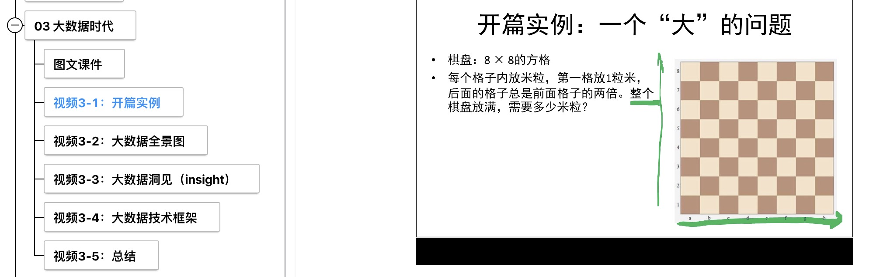
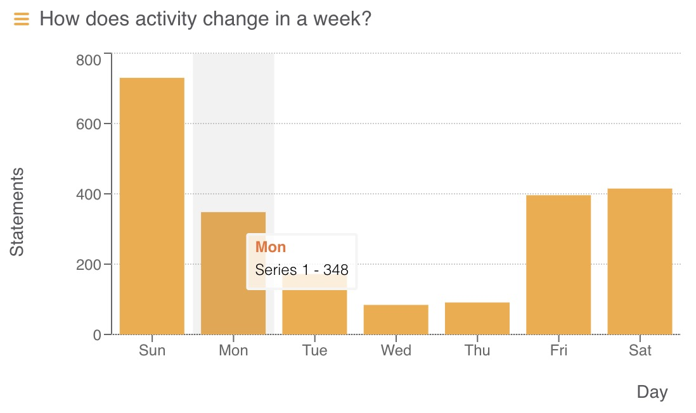
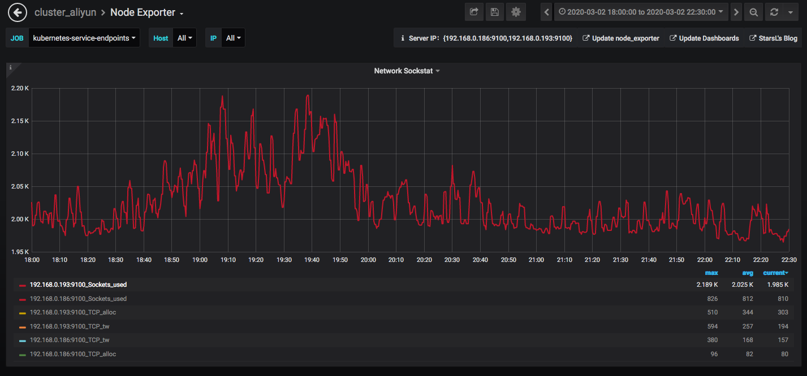
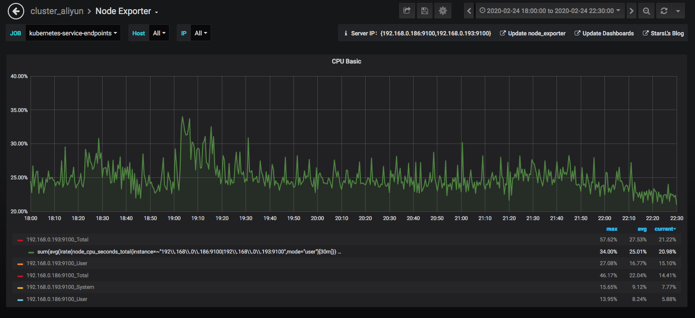
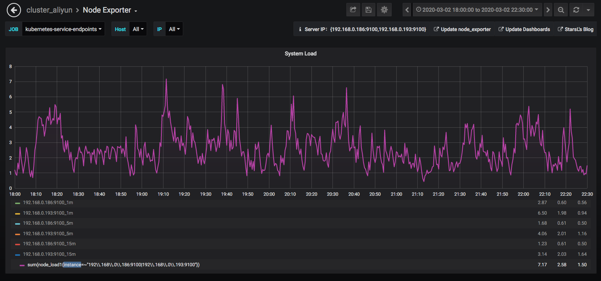
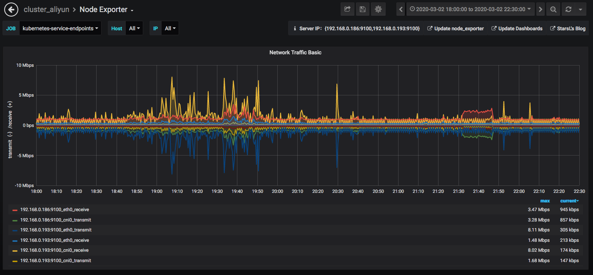

《大数据与人工智能通识导论》周报 Week3
=
**开设学校**：湖北大学

**任课教师**：杨丽

**课程时间**：周一 19:00-21:35

**上课人数**：104人

**设课形式**：理论课采用MOOC的形式，主要以视频播放为主，配合微信群进行答疑。

一、本次课程内容
-

- 大数据时代
  - 图文课件
  - 开篇实例
  - 大数据全景图
  - 大数据洞见（insight）
  - 大数据技术框架
  - 总结

二、课程形式
-

学生通过KFCoding平台的课程入口进入，结合PPT进行视频学习。

三、数据情况
-

- **学生:**
  1. 较前两周相比学生提前看课程行为明显减少，访问高峰出现在规定开始上课的时间端，其中以第一节课时间段见长。
  2. 与前两次课程相比，学生总体点击率呈持续下降趋势，考虑部分学生存在延期看视频或提前看的可能。
  3. 从请求峰值判断学生的确有多个视频访问的行为，可初步排除不认真的可能。

- **服务器:**
  1. 服务请求出现的提升发生在19：00以后，并且呈稳定访问趋势，与前两次课相比，峰值降低，由交错访问的时间因素平摊负载，完全能满足上课所需。
  2. 系统cpu占用率并不高，用户cpu占用也没有遇到瓶颈。
  3. 针对学生对课程参与度的分析，尝试细粒度查询学生的课程点击情况与视频观看数据。

