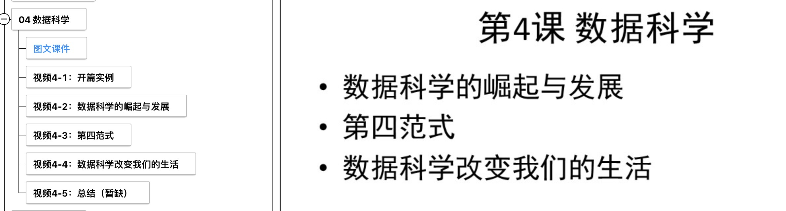
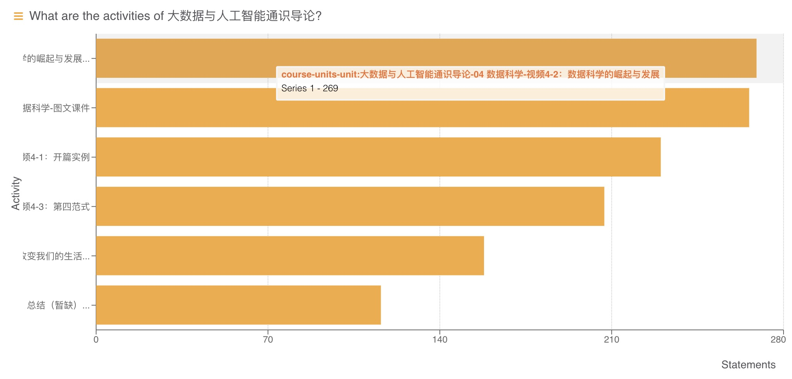
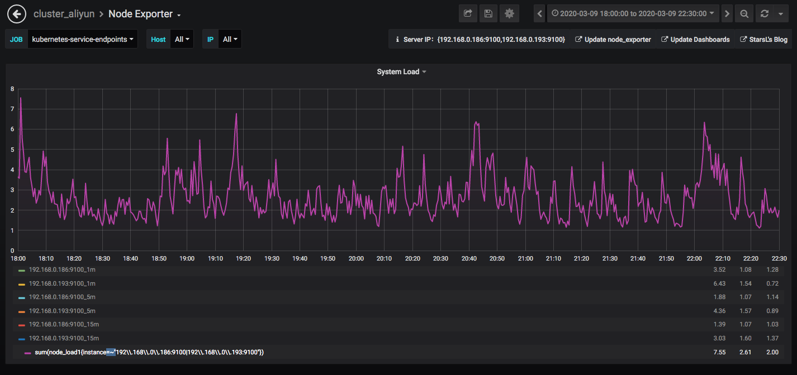
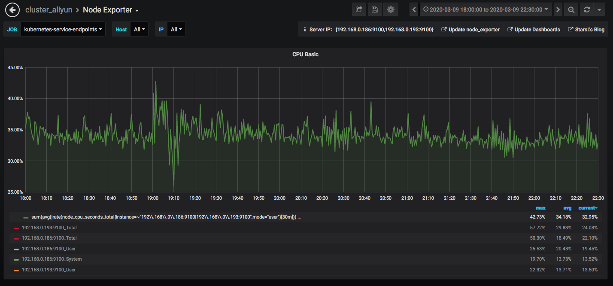
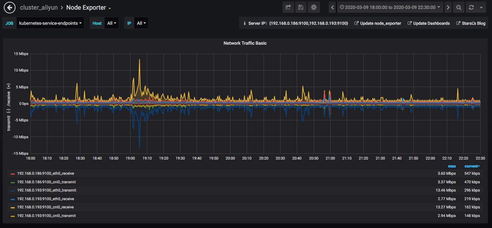
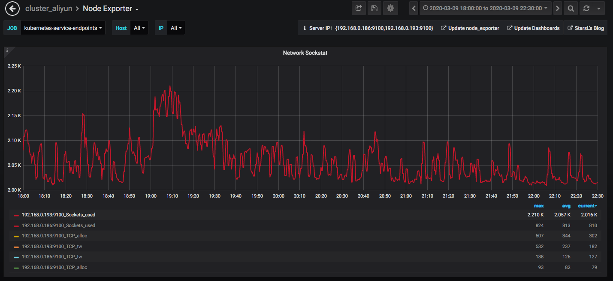

《大数据与人工智能通识导论》周报 Week4
=
**开设学校**：湖北大学

**任课教师**：杨丽

**课程时间**：周一 19:00-21:35

**上课人数**：104人

**设课形式**：理论课采用MOOC的形式，主要以视频播放为主，配合微信群进行答疑。

一、本次课程内容
-

- 数据科学
  - 图文课件
  - 开篇实例
  - 数据科学的崛起与发展
  - 第四范式
  - 数据科学改变我们的生活
  - 总结

二、课程形式
-

学生通过KFCoding平台的课程入口进入，结合PPT进行视频学习。

三、数据情况
-

- **学生:**
  1. 较前三周相比基本可以看出学生能按时访问上课内容。
  2. 由于对看板数据形式进行了修改，便于分析。与之前相比，学生总体点击量稍有增多。
  3. 现在可具体得知每个单元的点击数量，可得知各个单元点击数均多于上课人数，学生上课积极性乐观。

- **服务器:**
  1. 大部分服务请求发生在19：00以后，并且呈稳定访问趋势。
  2. 一些学校新学期正式开始，平台压力增大，周一的运行情况看来服务器并没有出现高负载情况，系统cpu占用率并不高，用户cpu占用也没有遇到瓶颈，完全能满足上课所需。
  3. 此次针对本课程学生行为采集进行了一些调整，对于单元点击数有了更直观的观察，为分析提供便利。
  4. 后需考虑对数据进行更规范的管理，方便聚类或者联合查询信息，ex.对该课程下的用户进行更细粒度的单元点击查询，落实到每个用户对每个单元的操作上；引入视频观看时长信息，对课程学习的完整度进行考评。

