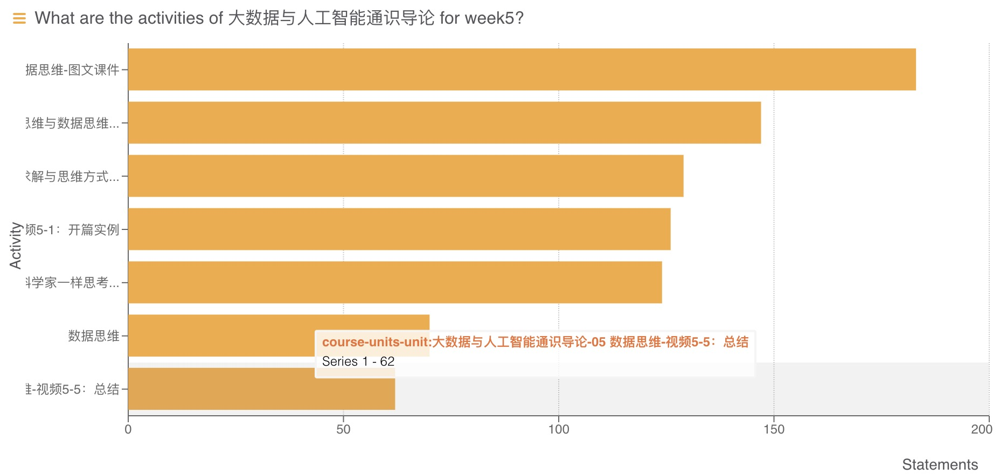

《大数据与人工智能通识导论》周报 Week6
=
**开设学校**：湖北大学

**任课教师**：杨丽

**课程时间**：周一 19:00-21:35

**上课人数**：104人

**设课形式**：理论课采用MOOC的形式，主要以视频播放为主，配合微信群进行答疑。

一、本次课程内容
-

- 数据科学
  - 图文课件
  - 开篇实例
  - 问题求解与思维方式
  - 计算思维与数据思维
  - 像数据科学家一样思考
  - 总结

二、课程形式
-

学生通过KFCoding平台的课程入口进入，结合PPT进行视频学习。

三、数据情况
-

- **学生:**
  1. 较前三周相比基本可以看出学生能按时访问上课内容。但是从表中数据看人数存疑。
  2. 由于对看板数据形式进行了修改，现在能展示课程点击的总人数与视频访问总人数。
  3. 从数据情况看，部分学生在上课时间并没有访问过课程，且总体访问过课程的人数比课程设计的总人数少。
  4. 课程视频的每个单元平均观看时间与视频时间基本相仿。此平均时间数据未算上没有访问课程的用户，因此，参与视频课程的用户基本能完整看完视频。

- **服务器:**
  1. 大部分服务请求发生在19：00以后，并且呈稳定访问趋势。且峰值降低（与人数减少相关）
  2. 周一的运行情况看来服务器并没有出现高负载情况，系统cpu占用率并不高，用户cpu占用也没有遇到瓶颈，完全能满足上课所需。
  3. 此次针对本课程学生行为采集进行了一些调整，对于单元点击数有了更直观的观察，为分析提供便利，新增了对于学生人数的统计与视频观看时间的统计。
  4. 每个账号具体的单元停留时间数据保存于[data3.csv](./scripts/data3.csv)文件中，可自行查看。
  5. 由于统计方式的特殊性，时间统计存在不可忽视的误差，但也具有指导意义。

