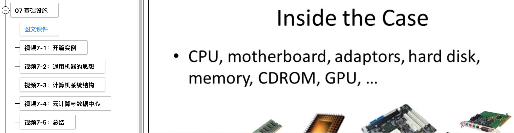
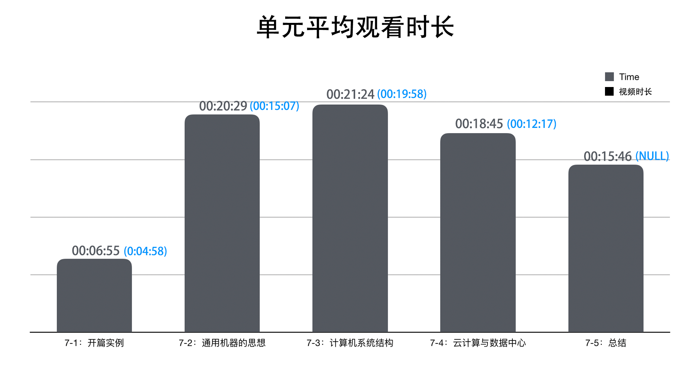
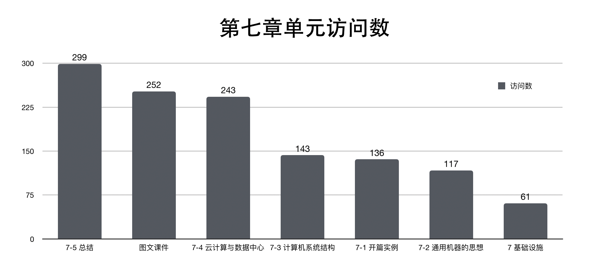
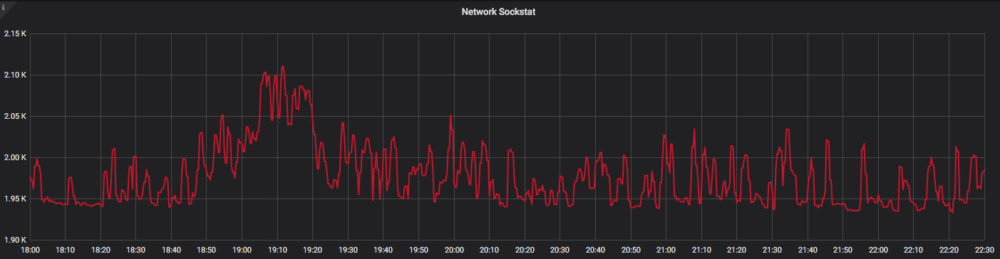
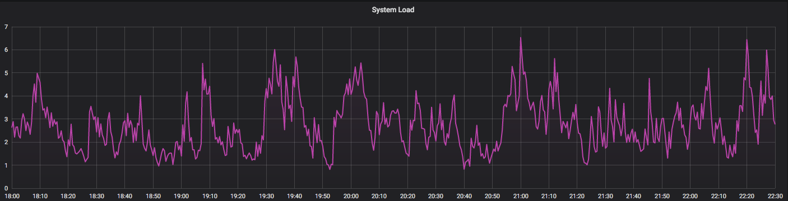
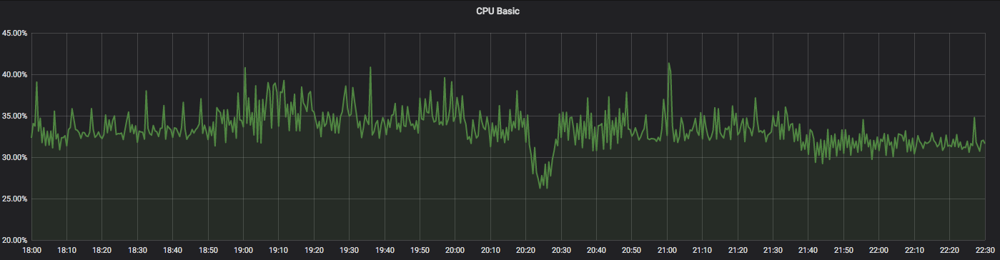
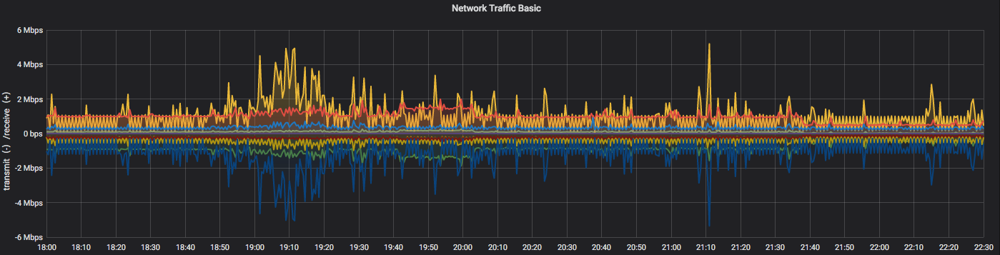

《大数据与人工智能通识导论》周报 Week7
=
**开设学校**：湖北大学

**任课教师**：杨丽

**课程时间**：周一 19:00-21:35

**上课人数**：104人

**设课形式**：理论课采用MOOC的形式，主要以视频播放为主，配合微信群进行答疑。

一、本次课程内容
-

- 基础设施 
  - 图文课件
  - 开篇实例
  - 通用机器的思想
  - 计算机系统结构
  - 云计算与数据中心
  - 总结

二、课程形式
-

学生通过KFCoding平台的课程入口进入，结合PPT进行视频学习。

三、数据情况
-

- **学生:**
  1. 优化了数据筛选，现在可以正确显示课程总访问人数，总访问人数基本不会变动，推测今后的课程总访问人数不会有太大变化。
  2. 相较于上一周，本章节的访问人数出现下降趋势，有学员没有及时参与课程。
  3. 相交于上一周。第六张视频总访问人数减少了5人，这次与本章节访问人数持平，说明未及时参与课程内容的学生连课程单元都未进入。
  4. 本周课程视频的单元平均观看时间与原视频时间基本持平，所有单元的课程观看时间与原视频时间基本无异。表明参与课程学习的学员都能保质保量完成学习目标。
  5. 此平均时间数据未算上没有访问课程的用户，因此，参与视频课程的用户基本能完整看完视频。由于统计方式的特殊性，时间统计存在不可忽视的误差，但也具有指导意义。

- **服务器:**
  1. 大部分客户端请求仍集中在19：00以后，并且呈稳定访问趋势。且峰值降低（与人数减少相关）
  2. 周一的运行情况看来服务器并没有出现高负载情况，系统cpu占用率并不高，用户cpu占用也没有遇到瓶颈，完全能满足上课所需。
  3. 接下来会考虑更好的report界面呈现以及数据的展现形式，重点分析服务器性能数据。
  4. 每个账号具体的单元停留时间数据保存于[ Week7.csv](./scripts/Week7.csv)文件中，可自行查看。

